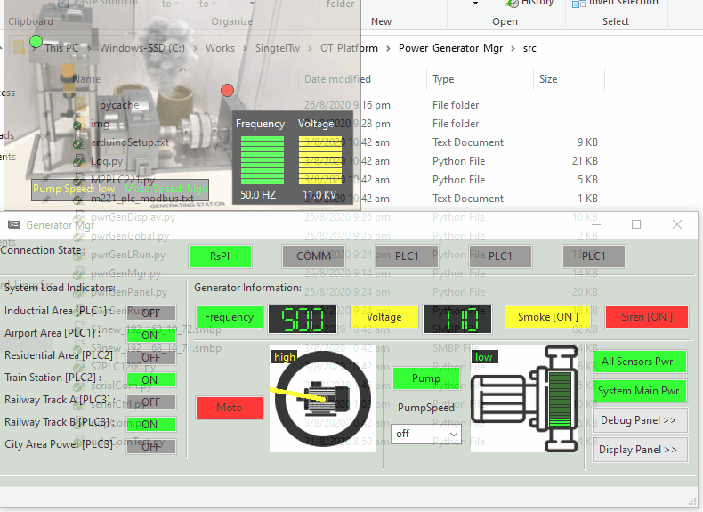
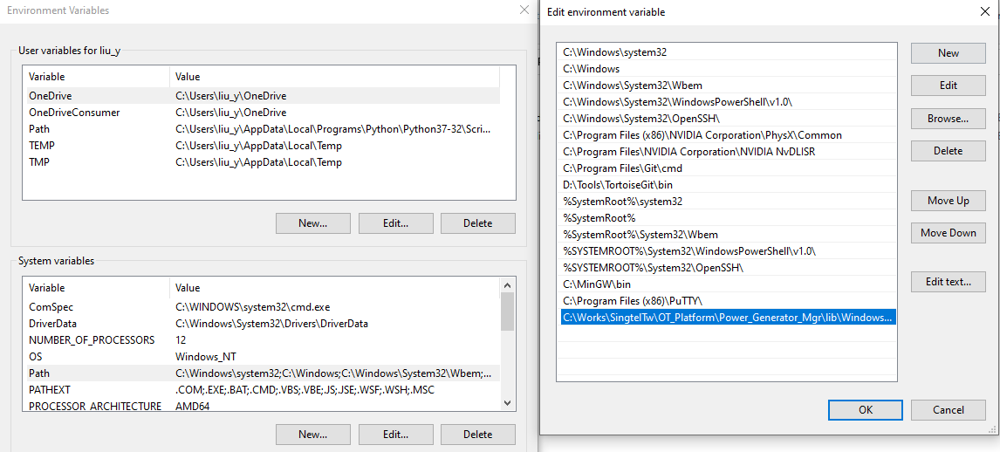

# Power_Generator_Manager
#### Introduction

This project contains two sections:

**Power generator auto-control program**: This module will be running in the Raspberry PI to control the OT-Power Generator Module's hardware. It will send command to PLC and Arduino and receive the control request from the remove controller. The control program will do the adjust of the generator's motor and pump speed based on the loads in the system. 

**Remote generator controller:** This module will provide a UI to connect to the power generator auto control program by UDP and display the generator states.

###### Remote Controller UI 


###### Situation Display UI



------

#### Program Setup

###### Development Environment: Python3.7.4

###### Additional Lib/Software Need:

1. snap7 + python-snap7 (need to install for S71200 PLC control)

   ```
   Install instruction on linux: 
   http://simplyautomationized.blogspot.com/2014/12/raspberry-pi-getting-data-from-s7-1200.html
   ```

   Install snap7 on windows: 

   - 1.1 Install snap7 module from PIP:

     ```
     pip install python-snap7
     ```

   - 1.2 Setup snap7 Used dll and lib file system environment path: 

     Computer **>** System Property **>** Advanced system settings **>** Environment Variables **>** System variable: 

     

2. wxPython

   ```
   pip install wxPython
   ```

3. 

###### Program File List: 

| Program File             | Execution Env | Description                                                  |
| ------------------------ | ------------- | ------------------------------------------------------------ |
| M2PLC221.py              | python 2/3    | This module is used to connect to the Schneider M2xx PLC.    |
| pwrGenGlobal.py          | python 3      | This module is used as a local config file to set constants, global parameters which will be used in the other modules. |
| pwrGenMgr.py             | python 3      | Power generator auto-control manager.                        |
| pwrGenPanel.py           | python 3      | This module is used to create different function panels.     |
| pwGenRun.py              | python 3      | This module is used to create the control panel to connect to the Raspberry PI generator control by UDP. |
| S1new_192_168_10_72.smbp | PLC           | PLC-1 ladder diagram.                                        |
| S3new_192_168_10_71.smbp | PLC           | PLC-3 ladder diagram.                                        |
| S7PLC1200.py             | python 3      | This module is used to connect to the siemens s7-1200 PLC.   |
| serialCom.py             | python 3      | This module will inheritance the python built-in serial module with automatically serial port serach and connection function. |
| udpCom.py                | python 3      | This module will provide a UDP client and server communication API. |

------

#### Program Usage

1. Set the test mode flag TEST_MD to False, set the IP address in pwGenRun.py to the Raspberry PI's IP. 

2. In Raspberry PI run cmd: 

   ```
   python3 pwrGenMgr.py
   ```

3. In the control computer, run cmd: 

   ```
   python pwrGenRun.py
   ```

4. -

------

> Last edited by LiuYuancheng(liu_yuan_cheng@hotmail.com) at 17/04/2020