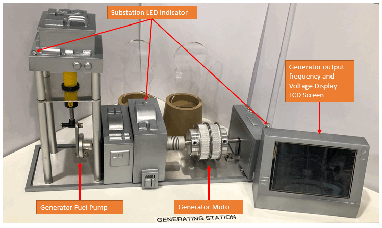

# Power_Generator_Manager
> All rights reserved by NUS-Singtel Cyber Security R&D Lab (Jun 2016 to Jun 2021)

**Program Design Purpose**: We want to create a HMI program running on the monitor PC and an auto controller program running on raspberry PI to control the power generator simulator module. 

[TOC]

### Introduction

The OT 3D Platform contents a power generator module which is used to simulate the power generation for the module’s inner and outer railway, train substation and system’s power supply. The power generator is directly controlled by an Arduino with signal(H/L) change, we use the USB cable connect the Raspberry PI to the Arduino to control the LEDs, LCD screen, smoke indicator frequency and siren with serial commands. The Arduino also has 4 pins to control the speed of moto and pump and the 4 pins are connected to the PLC with jumper wire. For the remote-control software part, we have implemented 2 programs: Power generator auto-control program (main controller) and Remote generator controller (HMI for user). The system connection is show below: 


The software contains two sections:

**Power generator auto-control program**: This module will be running in the Raspberry PI to control the OT-Power Generator Module's hardware. It will send command to PLC and Arduino and receive the control request from the remove controller. The control program will do the adjust of the generator's motor and pump speed based on the loads in the system. 

**Remote generator controller:** This module will provide a UI to connect to the power generator auto control program by UDP and display the generator states.

##### Remote Controller HMI UI 


##### Generator Situation Display UI

This panel will show the currently situation of all the components (introduced in the section 1.1 hardware introduction) of the Generator, when the smoke is set to “slow”, the smoke icon shown in the panel will be changed to gray color. Blue color icon means setting is “fast”. When the alter raised, the top right “Alert” icon will appear and flash. Check the “Generator Pnl” checkbox in the main UI, this panel will pop up on the bottom of the screen and layout above all the windows. 


------

### System/Program Design

Reference to design document in the doc folder : `doc/CSI OT 3D Platform Cyber Attack Power Generator Deisgn.docx` 


------

### System Program Setup

##### Development Environment

###### Python3.7.4

##### Additional Lib/Software Need

1. snap7 + python-snap7 (need to install for S71200 PLC control)

   ```
   Install instruction on linux: 
   http://simplyautomationized.blogspot.com/2014/12/raspberry-pi-getting-data-from-s7-1200.html
   ```

   Install snap7 on windows: 

   - 1.1 Install snap7 module from PIP:

     ```
     pip install python-snap7
     ```

   - 1.2 Setup snap7 Used dll and lib file system environment path: 

     Computer **>** System Property **>** Advanced system settings **>** Environment Variables **>** System variable: 

     

2. wxPython

   ```
   pip install wxPython
   ```

3. 

##### Hardware Needed 



##### Program File List

| Program File             | Execution Env | Description                                                  |
| ------------------------ | ------------- | ------------------------------------------------------------ |
| M2PLC221.py              | python 2/3    | This module is used to connect to the Schneider M2xx PLC.    |
| pwrGenGlobal.py          | python 3      | This module is used as a local config file to set constants, global parameters which will be used in the other modules. |
| pwrGenMgr.py             | python 3      | Power generator auto-control manager.                        |
| pwrGenPanel.py           | python 3      | This module is used to create different function panels.     |
| pwGenRun.py              | python 3      | This module is used to create the control panel to connect to the Raspberry PI generator control by UDP. |
| S1new_192_168_10_72.smbp | PLC           | PLC-1 ladder diagram.                                        |
| S3new_192_168_10_71.smbp | PLC           | PLC-3 ladder diagram.                                        |
| S7PLC1200.py             | python 3      | This module is used to connect to the siemens s7-1200 PLC.   |
| serialCom.py             | python 3      | This module will inheritance the python built-in serial module with automatically serial port serach and connection function. |
| pwrSibDisplay.py         | python3       | This module is used to create a transparent, no window board live substation control parameter simulation display frame which shows overlay on top of the CSI OT-Platform main HMI program. |
| udpCom.py                | python 3      | This module will provide a UDP client and server communication API. |
| tcpCom.py                | python 3      | This module will provide TCP client and server communication API. |
| pwrSubParm.csv           | excel         | This file will save the 10 parameters data which used to simulate the substation working situation. |
| run.bat                  |               | Program execution script for Windows user.                   |
| BgCtrl.py                | python        | This module is used to create a background program controller: When we want to run a program in back ground with a loop inside, some time it is difficult for us to track whether the program is  running or stopped if there are lots of other similar background programs are also running. This module is used to create a record file to record the current background program situation for the user to check and control. |

------

### Program Usage/Execution

1. Set the test mode flag TEST_MD to False, set the IP address in pwGenRun.py to the Raspberry PI's IP. 

2. In Raspberry PI run cmd: 

   ```
   python3 pwrGenMgr.py
   ```

3. In the control computer, run cmd: 

   ```
   python pwrGenRun.py
   ```

4. -


------

### Problem and Solution

Refer to the doc: 

- https://github.com/LiuYuancheng/Power_Generator_Manager/blob/master/doc/problemAndSolution.md
- https://github.com/LiuYuancheng/Power_Generator_Manager/blob/master/doc/wxpython%20install%20error%20and%20solution.md


------

### Reference

Detail design doc: https://github.com/LiuYuancheng/Power_Generator_Manager/blob/master/doc/CSI%20OT%203D%20Platform%20Cyber%20Attack%20Power%20Generator%20Deisgn.docx


------

> Last edited by LiuYuancheng(liu_yuan_cheng@hotmail.com) at 17/04/2020

